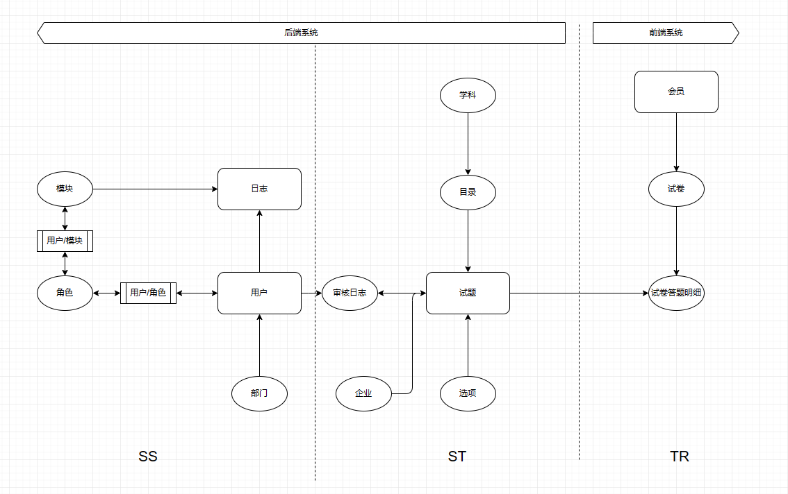

# Cool刷题项目制作

## 系统架构

### 后台系统【技术框架】

#### 1.Page:AdminLTE+AJAX+JQuery+zTree

#### 2.Controll[表现层]:Servlet3.0+文件上传下载

#### 3.Service[业务层]:POI

#### 4.Dao[数据层]::MyBatis

#### 5.DB:MySQL

### MYSQL

### 前台系统【技术框架】

#### 1.Page:Vue+Element UI

#### 2.Controll[表现层]:Servlet3.0

#### 3.Service[业务层]:Redis

#### 4.Dao[数据层]:MyBatis

#### 5.DB:MySQL

## 需求分析

## 工程搭建

### 1.创建maven工程（web工程）

### 2.导入项目依赖的坐标（资源）

### 3.补全目录结构

### 4.创建三层架构开发的包层次结构

