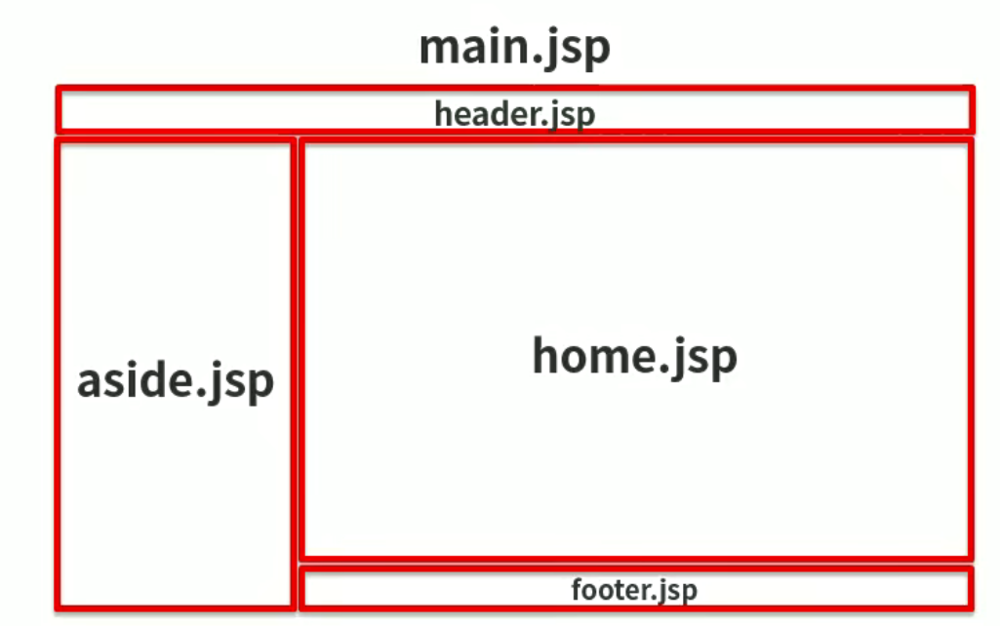

# Cool刷题项目制作

[TOC]


## 系统架构

### 后台系统【技术框架】

#### 1.Page:AdminLTE+AJAX+JQuery+zTree

#### 2.Controll[表现层]:Servlet3.0+文件上传下载

#### 3.Service[业务层]:POI

#### 4.Dao[数据层]::MyBatis

#### 5.DB:MySQL

### MYSQL

### 前台系统【技术框架】

#### 1.Page:Vue+Element UI

#### 2.Controll[表现层]:Servlet3.0

#### 3.Service[业务层]:Redis

#### 4.Dao[数据层]:MyBatis

#### 5.DB:MySQL

## 需求分析


## 工程搭建

### 1.创建maven工程（web工程）

### 2.导入项目依赖的坐标（资源）

#### poem.xml

```xml
<?xml version="1.0" encoding="UTF-8"?>
<project xmlns="http://maven.apache.org/POM/4.0.0"
         xmlns:xsi="http://www.w3.org/2001/XMLSchema-instance"
         xsi:schemaLocation="http://maven.apache.org/POM/4.0.0 http://maven.apache.org/xsd/maven-4.0.0.xsd">
    <modelVersion>4.0.0</modelVersion>

    <groupId>com.colincora</groupId>
    <artifactId>CoolSTS</artifactId>
    <version>1.0-SNAPSHOT</version>


    <properties>
        <project.build.sourceEncoding>UTF-8</project.build.sourceEncoding>
        <maven.compiler.source>1.8</maven.compiler.source>
        <maven.compiler.target>1.8</maven.compiler.target>
    </properties>

    <dependencies>
        <!--mybatis_-->
        <dependency>
            <groupId>org.mybatis</groupId>
            <artifactId>mybatis</artifactId>
            <version>3.5.3</version>
        </dependency>
        <!--分页插件-->
        <dependency>
            <groupId>com.github.pagehelper</groupId>
            <artifactId>pagehelper</artifactId>
            <version>5.1.2</version>
        </dependency>
        <!--mysql-->
        <dependency>
            <groupId>mysql</groupId>
            <artifactId>mysql-connector-java</artifactId>
            <version>5.1.46</version>
        </dependency>
        <!--druid数据源-->
        <dependency>
            <groupId>com.alibaba</groupId>
            <artifactId>druid</artifactId>
            <version>1.1.21</version>
        </dependency>
        <!--junit-->
        <dependency>
            <groupId>junit</groupId>
            <artifactId>junit</artifactId>
            <version>4.12</version>
            <scope>test</scope>
        </dependency>
        <!-- servlet3.0 -->
        <dependency>
            <groupId>javax.servlet</groupId>
            <artifactId>javax.servlet-api</artifactId>
            <version>3.1.0</version>
            <scope>provided</scope>
        </dependency>
        <!--jsp-->
        <dependency>
            <groupId>javax.servlet.jsp</groupId>
            <artifactId>javax.servlet.jsp-api</artifactId>
            <version>2.3.3</version>
            <scope>provided</scope>
        </dependency>
        <!--bean-utils-->
        <dependency>
            <groupId>commons-beanutils</groupId>
            <artifactId>commons-beanutils</artifactId>
            <version>1.9.4</version>
        </dependency>
        <!--apache工具包-->
        <dependency>
            <groupId>org.apache.commons</groupId>
            <artifactId>commons-lang3</artifactId>
            <version>3.9</version>
        </dependency>
        <!--jstl-->
        <dependency>
            <groupId>jstl</groupId>
            <artifactId>jstl</artifactId>
            <version>1.2</version>
        </dependency>
        <!--jackson-->
        <dependency>
            <groupId>com.fasterxml.jackson.core</groupId>
            <artifactId>jackson-annotations</artifactId>
            <version>2.9.0</version>
        </dependency>
        <dependency>
            <groupId>com.fasterxml.jackson.core</groupId>
            <artifactId>jackson-core</artifactId>
            <version>2.9.0</version>
        </dependency>
        <dependency>
            <groupId>com.fasterxml.jackson.core</groupId>
            <artifactId>jackson-databind</artifactId>
            <version>2.9.0</version>
        </dependency>
        <!--文件上传-->
        <dependency>
            <groupId>commons-fileupload</groupId>
            <artifactId>commons-fileupload</artifactId>
            <version>1.3.1</version>
        </dependency>
        <!--POI-->
        <dependency>
            <groupId>org.apache.poi</groupId>
            <artifactId>poi</artifactId>
            <version>4.0.1</version>
        </dependency>
        <dependency>
            <groupId>org.apache.poi</groupId>
            <artifactId>poi-ooxml</artifactId>
            <version>4.0.1</version>
        </dependency>
        <dependency>
            <groupId>org.apache.poi</groupId>
            <artifactId>poi-ooxml-schemas</artifactId>
            <version>4.0.1</version>
        </dependency>
    </dependencies>

    <build>
        <plugins>
            <!--tomcat插件-->
            <plugin>
                <groupId>org.apache.tomcat.maven</groupId>
                <artifactId>tomcat7-maven-plugin</artifactId>
                <version>2.1</version>
                <configuration>
                    <port>8081</port>
                    <path>/</path>
                </configuration>
            </plugin>
        </plugins>
    </build>
<packaging>war</packaging>

</project>
```

### 3.补全目录结构

### 4.创建三层架构开发的包层次结构


### 导入AdminLTE框架进行页面的快速搭建




## 企业模块制作 -数据层 

### 实体类制作

##### com.colincora.domain.store.company

```java
package com.colincora.domain.store;

import java.util.Date;

/**
 * @author colincora
 * @date 2023/3/14 10:23
 */
public class company {
    private String id;
    private String name;
    private Date expirationDate;
    private String address;
    private String licenseId;
    private String representative;
    private String phone;
    private String companySize;
    private String industry;
    private String remarks;
    private Integer state;
    private String city;

    public String getId() {
        return id;
    }

    public void setId(String id) {
        this.id = id;
    }

    public String getName() {
        return name;
    }

    public void setName(String name) {
        this.name = name;
    }

    public Date getExpirationDate() {
        return expirationDate;
    }

    public void setExpirationDate(Date expirationDate) {
        this.expirationDate = expirationDate;
    }

    public String getAddress() {
        return address;
    }

    public void setAddress(String address) {
        this.address = address;
    }

    public String getLicenseId() {
        return licenseId;
    }

    public void setLicenseId(String licenseId) {
        this.licenseId = licenseId;
    }

    public String getRepresentative() {
        return representative;
    }

    public void setRepresentative(String representative) {
        this.representative = representative;
    }

    public String getPhone() {
        return phone;
    }

    public void setPhone(String phone) {
        this.phone = phone;
    }

    public String getCompanySize() {
        return companySize;
    }

    public void setCompanySize(String companySize) {
        this.companySize = companySize;
    }

    public String getIndustry() {
        return industry;
    }

    public void setIndustry(String industry) {
        this.industry = industry;
    }

    public String getRemarks() {
        return remarks;
    }

    public void setRemarks(String remarks) {
        this.remarks = remarks;
    }

    public Integer getState() {
        return state;
    }

    public void setState(Integer state) {
        this.state = state;
    }

    public String getCity() {
        return city;
    }

    public void setCity(String city) {
        this.city = city;
    }
}

```

### Dao层制作

> #### 实现层用mybatis 只用写dao接口就可以不用写dao实现 通过自动生成形式去创建实现类

#### com.colincora.dao.store.CompanyDao

```java
package com.colincora.dao.store;

import com.colincora.domain.store.Company;

import java.util.List;

/**
 * @author colincora
 * @date 2023/3/14 10:27
 */
public interface CompanyDao {
    int save(Company company);

    int delete(Company company);

    int update(Company company);

    Company findById(String id);

    List<Company> findAll();
}
```

#### CompanyDao配置文件

##### jdbc.properties

```xml
jdbc.driver=com.mysql.jdbc.Driver
jdbc.url=jdbc:mysql://localhost:3306/coolsts
jdbc.username=root
jdbc.password=root
```

##### SqlMapConfig.xml

```xml
<?xml version="1.0" encoding="UTF-8"?>
<!DOCTYPE configuration
        PUBLIC "-//mybatis.org//DTD Config 3.0//EN"
        "http://mybatis.org/dtd/mybatis-3-config.dtd">
<!--mybatis的主配置文件-->
<configuration>
    <!--定义property的配置-->
    <properties resource="jdbc.properties"></properties>


    <!--配置别名:别名配置是给实体类用的，不能用在dao上-->
    <typeAliases>
        <!--指定实体类所在的包，此时包下所有类都会注册别名，别名就是类名称-->
        <package name="com.colincora.domain"></package>
    </typeAliases>

    <!--配置分页插件，plugins标签有出现顺序要求，必须在environments之前，同时要在properties和typeAliases之后 -->
    <plugins>
        <!-- com.github.pagehelper.PageInterceptor -->
        <plugin interceptor="com.github.pagehelper.PageInterceptor">
            <property name="helperDialect" value="mysql"/>
            <property name="reasonable" value="true"/>
        </plugin>
    </plugins>

    <!--配置默认环境-->
    <environments default="mysql">
        <!--配置mysql的环境-->
        <environment id="mysql">
            <!--配置事务的类型-->
            <transactionManager type="JDBC"></transactionManager>
            <!--配置数据源信息-->
            <dataSource type="POOLED">
                <!--配置连接数据库的四个基本信息-->
                <property name="driver" value="${jdbc.driver}"></property>
                <property name="url" value="${jdbc.url}"></property>
                <property name="username" value="${jdbc.username}"></property>
                <property name="password" value="${jdbc.password}"></property>
            </dataSource>
        </environment>
    </environments>


    <!--配置映射配置文件的位置-->
    <mappers>
        <!--指定实体映射配置文件所在的包，指定的是dao接口所在的包-->
        <package name="com.colincora.dao"></package>
    </mappers>


</configuration>
```

##### CompanyDao.xml

```xml
<?xml version="1.0" encoding="UTF-8"?>
<!DOCTYPE mapper PUBLIC "-//mybatis.org//DTD Mapper 3.0//EN" "http://mybatis.org/dtd/mybatis-3-mapper.dtd">
<mapper namespace="com.itheima.dao.store.CompanyDao">

    <!--配置实体类属性和数据库表中列的对应关系-->
    <resultMap id="BaseResultMap" type="com.itheima.domain.store.Company">
        <id column="id" jdbcType="VARCHAR" property="id"/>
        <result column="name" jdbcType="VARCHAR" property="name"/>
        <result column="expiration_date" jdbcType="TIMESTAMP" property="expirationDate"/>
        <result column="address" jdbcType="VARCHAR" property="address"/>
        <result column="license_id" jdbcType="VARCHAR" property="licenseId"/>
        <result column="representative" jdbcType="VARCHAR" property="representative"/>
        <result column="phone" jdbcType="VARCHAR" property="phone"/>
        <result column="company_size" jdbcType="VARCHAR" property="companySize"/>
        <result column="industry" jdbcType="VARCHAR" property="industry"/>
        <result column="remarks" jdbcType="VARCHAR" property="remarks"/>
        <result column="state" jdbcType="INTEGER" property="state"/>
        <result column="city" jdbcType="VARCHAR" property="city"/>
    </resultMap>

    <!--配置查询的列名公共SQL语句-->
    <sql id="Base_Column_List">
        id, name, expiration_date, address, license_id, representative, phone, company_size,industry, remarks, state, city
    </sql>

    <!--配置查询所有，带条件-->
    <select id="findAll" resultMap="BaseResultMap">
        select
        <include refid="Base_Column_List"/>
        from st_company
    </select>

    <!--配置根据ID查询-->
    <select id="findById" parameterType="java.lang.String" resultMap="BaseResultMap">
        select
        <include refid="Base_Column_List"/>
        from st_company
        where id = #{id,jdbcType=VARCHAR}
    </select>

    <!--配置根据id删除-->
    <delete id="delete" parameterType="java.lang.String">
        delete
        from st_company
        where id = #{id,jdbcType=VARCHAR}
    </delete>

    <!--配置全字段插入-->
    <insert id="save" parameterType="com.itheima.domain.store.Company">
        insert into st_company (id, name, expiration_date,
                                address, license_id, representative,
                                phone, company_size, industry,
                                remarks, state,
                                city)
        values (#{id,jdbcType=VARCHAR}, #{name,jdbcType=VARCHAR}, #{expirationDate,jdbcType=TIMESTAMP},
                #{address,jdbcType=VARCHAR}, #{licenseId,jdbcType=VARCHAR}, #{representative,jdbcType=VARCHAR},
                #{phone,jdbcType=VARCHAR}, #{companySize,jdbcType=VARCHAR}, #{industry,jdbcType=VARCHAR},
                #{remarks,jdbcType=VARCHAR}, #{state,jdbcType=INTEGER},
                #{city,jdbcType=VARCHAR})
    </insert>

    <!--配置全字段更新-->
    <update id="update" parameterType="com.itheima.domain.store.Company">
        update st_company
        set name            = #{name,jdbcType=VARCHAR},
            expiration_date = #{expirationDate,jdbcType=TIMESTAMP},
            address         = #{address,jdbcType=VARCHAR},
            license_id      = #{licenseId,jdbcType=VARCHAR},
            representative  = #{representative,jdbcType=VARCHAR},
            phone           = #{phone,jdbcType=VARCHAR},
            company_size    = #{companySize,jdbcType=VARCHAR},
            industry        = #{industry,jdbcType=VARCHAR},
            remarks         = #{remarks,jdbcType=VARCHAR},
            state           = #{state,jdbcType=INTEGER},
            city            = #{city,jdbcType=VARCHAR}
        where id = #{id,jdbcType=VARCHAR}
    </update>
</mapper>
```

#### mybatis session工厂初始化

##### com.colincora.factory.MapperFactory 

> ##### 用于生成dao接口代理实现类的工厂

```java
package com.colincora.factory;

import org.apache.ibatis.io.Resources;
import org.apache.ibatis.session.SqlSession;
import org.apache.ibatis.session.SqlSessionFactory;
import org.apache.ibatis.session.SqlSessionFactoryBuilder;

import java.io.InputStream;

/**
 * 用于生成dao接口代理实现类的工厂
 * @author ColinCora
 * @Company http://www.github.com/SFYYH
 */
public class MapperFactory {

    private static SqlSessionFactory factory;
    private static ThreadLocal<SqlSession> tl = new ThreadLocal<SqlSession>();

    static {
        InputStream in = null;
        try {
            //1.读取mybatis主配置文件
            in = Resources.getResourceAsStream("SqlMapConfig.xml");
            //2.创建构建者对象
            SqlSessionFactoryBuilder builder = new SqlSessionFactoryBuilder();
            //3.使用构建者创建SqlSessionFactory工厂
            factory = builder.build(in);
        }catch (Exception e){
            //打印异常信息到控制台
            e.printStackTrace();
            //抛出错误提示程序终止执行
            throw new ExceptionInInitializerError("初始化SqlSessionFactory失败");
        }finally {
            //释放流对象
            if(in != null){
                try{
                    in.close();
                }catch (Exception e){
                    e.printStackTrace();
                }
            }
        }
    }

    /**
     * 获取SqlSession对象
     * @return
     * 保留此方法是为了后面对业务层方法增强，利用AOP添加事务
     */
    public static SqlSession getSqlSession(){
         return factory.openSession(false);
    }

    /**
     * 获取Dao接口的代理实现类
     * @param daoClass dao接口字节码
     * @return
     */
    public static <T> T getMapper(SqlSession sqlSession,Class<T> daoClass){
        //1.判断传入的SqlSession是否为null
        if(sqlSession == null){
            return null;
        }
        //2.不为null，创建代理实现类
        return sqlSession.getMapper(daoClass);
    }
}

```

##### com.colincora.utils 

> ##### 用于数据提交、回滚、单独释放

```java
package com.colincora.utils;

import org.apache.ibatis.session.SqlSession;

/**
 * 事务控制类
 * @author ColinCora
 * @Company http://www.github.com/SFYYH
 */
public class TransactionUtil {

    /**
     * 提交释放
     * @param sqlSession
     */
    public static void commit(SqlSession sqlSession){
        if(sqlSession!=null) {
            sqlSession.commit();
        }
    }

    /**
     * 回滚释放
     * @param sqlSession
     */
    public static void rollback(SqlSession sqlSession){
        if(sqlSession!=null) {
            sqlSession.rollback();
        }
    }

    /**
     * 单独释放
     * @param sqlSession
     */
    public static void close(SqlSession sqlSession){
        if(sqlSession!=null) sqlSession.close();
    }
}

```


## 企业模块制作-业务层

> 基础功能：增、删、改、查、分页查
>
> 主要是转调我们的数据层

##### com.colincora.service.store.CompanyService.java

> 业务层调用接口

```java
package com.colincora.service.store;

import com.colincora.domain.store.Company;
import com.github.pagehelper.PageInfo;

import java.util.List;

public interface CompanyService {
    /**
     * 添加
     * @param company
     * @return
     */
    void save(Company company);

    /**
     * 删除
     * @param company
     * @return
     */
    void delete(Company company);

    /**
     * 更新
     * @param company
     * @return
     */
    void update(Company company);

    /**
     * 查询单个
     * @param id 查询的跳进啊
     * @return 查询的结果
     */
    Company findById(String id);

    /**
     * 查询全部的数据
     * @return 全部数据的列表对象
     */
    List<Company> findAll();

    /**
     * 分页查询数据
     * @param page 页码
     * @param size 每页显示数
     * @return
     */
    PageInfo findAll(int page,int size);
}
```

##### com.colincora.service.store.imp.CompanyServiceImp.java

> 接口实现层

```java
package com.colincora.service.store.impl;

import com.colincora.dao.store.CompanyDao;
import com.colincora.domain.store.Company;
import com.colincora.factory.MapperFactory;
import com.colincora.service.store.CompanyService;
import com.colincora.utils.TransactionUtil;
import com.github.pagehelper.PageHelper;
import com.github.pagehelper.PageInfo;
import org.apache.ibatis.session.SqlSession;

import java.util.List;
import java.util.UUID;

/**
 * @author colincora
 * @date 2023/3/14 11:01
 */
public class CompanyServiceImpl implements CompanyService {

    @Override
    public void save(Company company) {
        SqlSession sqlSession = null;
        try {
            //1.获取 sqlsession对象
            sqlSession = MapperFactory.getSqlSession();
            //2.获取dao
            CompanyDao companyDao = MapperFactory.getMapper(sqlSession, CompanyDao.class);
            //id使用UUID的生成策略来获取
            String id= UUID.randomUUID().toString();
            company.setId(id);
            //3.调用Dao层的操作
            companyDao.save(company);
            //4.提交事务
            TransactionUtil.commit(sqlSession);
        } catch (Exception e) {
            TransactionUtil.rollback(sqlSession);
            throw new RuntimeException(e);
            //记录日志
        } finally {
            try {
                TransactionUtil.close(sqlSession);
            } catch (Exception e) {
                e.printStackTrace();
            }
        }
    }

    @Override
    public void delete(Company company) {
        SqlSession sqlSession = null;
        try {
            //1.获取 sqlsession对象
            sqlSession = MapperFactory.getSqlSession();
            //2.获取dao
            CompanyDao companyDao = MapperFactory.getMapper(sqlSession, CompanyDao.class);
            //3.调用Dao层的操作
            companyDao.delete(company);
            //4.提交事务
            TransactionUtil.commit(sqlSession);
        } catch (Exception e) {
            TransactionUtil.rollback(sqlSession);
            throw new RuntimeException(e);
            //记录日志
        } finally {
            try {
                TransactionUtil.close(sqlSession);
            } catch (Exception e) {
                e.printStackTrace();
            }
        }
    }

    @Override
    public void update(Company company) {
        SqlSession sqlSession = null;
        try {
            //1.获取 sqlsession对象
            sqlSession = MapperFactory.getSqlSession();
            //2.获取dao
            CompanyDao companyDao = MapperFactory.getMapper(sqlSession, CompanyDao.class);
            //3.调用Dao层的操作
            companyDao.update(company);
            //4.提交事务
            TransactionUtil.commit(sqlSession);
        } catch (Exception e) {
            TransactionUtil.rollback(sqlSession);
            throw new RuntimeException(e);
            //记录日志
        } finally {
            try {
                TransactionUtil.close(sqlSession);
            } catch (Exception e) {
                e.printStackTrace();
            }


        }
    }

    @Override
    public Company findById(String id) {
        SqlSession sqlSession = null;
        try {
            //1.获取 sqlsession对象
            sqlSession = MapperFactory.getSqlSession();
            //2.获取dao
            CompanyDao companyDao = MapperFactory.getMapper(sqlSession, CompanyDao.class);
            //3.调用Dao层的操作
            return companyDao.findById(id);
        } catch (Exception e) {
            TransactionUtil.rollback(sqlSession);
            throw new RuntimeException(e);
            //记录日志
        } finally {
            try {
                TransactionUtil.close(sqlSession);
            } catch (Exception e) {
                e.printStackTrace();
            }
        }
    }

    @Override
    public List<Company> findAll() {
        SqlSession sqlSession = null;
        try {
            //1.获取 sqlsession对象
            sqlSession = MapperFactory.getSqlSession();
            //2.获取dao
            CompanyDao companyDao = MapperFactory.getMapper(sqlSession, CompanyDao.class);
            //3.调用Dao层的操作
            return companyDao.findAll();
        } catch (Exception e) {
            TransactionUtil.rollback(sqlSession);
            throw new RuntimeException(e);
            //记录日志
        } finally {
            try {
                TransactionUtil.close(sqlSession);
            } catch (Exception e) {
                e.printStackTrace();
            }
        }
    }

    @Override
    public PageInfo findAll(int page, int size) {
        SqlSession sqlSession = null;
        try {
            //1.获取 sqlsession对象
            sqlSession = MapperFactory.getSqlSession();
            //2.获取dao
            CompanyDao companyDao = MapperFactory.getMapper(sqlSession, CompanyDao.class);
            //3.调用Dao层的操作
            PageHelper.startPage(page,size);
            List<Company> all = companyDao.findAll();
            PageInfo pageInfo=new PageInfo(all);
            return pageInfo;
        } catch (Exception e) {
            TransactionUtil.rollback(sqlSession);
            throw new RuntimeException(e);
            //记录日志
        } finally {
            try {
                TransactionUtil.close(sqlSession);
            } catch (Exception e) {
                e.printStackTrace();
            }
        }
    }
}
```

##### 对业务层代码进行测试

##### com/colincora/service/store/CompanyServiceTest.java

```java
package com.colincora.service.store;

import com.colincora.domain.store.Company;
import com.colincora.service.store.impl.CompanyServiceImpl;
import com.github.pagehelper.PageInfo;
import org.junit.*;

/**
 * @author colincora
 * @date 2023/3/14 11:10
 */
public class CompanyServiceTest {
    private static CompanyService companyService=null;

    @BeforeClass
    public static void init(){
        companyService=new CompanyServiceImpl();
    }

    @Test
    public void testSave(){
        Company company=new Company();
        company.setName("测试数据");
        companyService.save(company);
    }

    @Test
    public void testFindAll(){
        PageInfo all = companyService.findAll(1, 100);
        System.out.println(all);
    }
    
    @AfterClass
    public static void destory(){
        companyService=null;
    }
}
```

